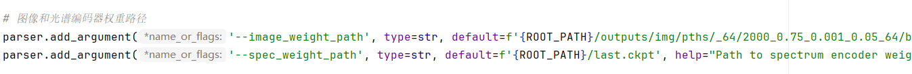

### 运行步骤
1. 修改root_path.py中的路径，最后不要加斜杠
2. 在ROOT_PATH目录下新建data文件夹，将数据解压到data文件夹中，目录结构为：ROOT_PATH/data/train_dataset
3. 运行spec_pretrain
4.运行img_pretrain(image_pretrain是没有加上测试集)
5. 我没有配置集群部署，可能要改一下
6. 运行clip_trainer,里面的预训练读取路径要改一下

